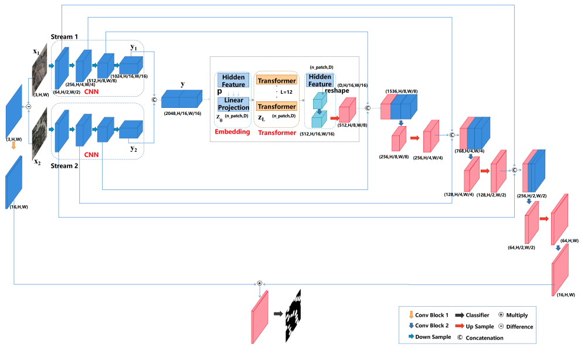

# TransUNetCD: A Hybrid Transformer Network for Change Detection in Optical Remote-Sensing Images

<<<<<<< HEAD

    

An unofficial implementation of ***TransUnetCD***
=======
"TransUNetCD: A Hybrid Transformer Network for Change Detection in Optical Remote-Sensing Images" unofficial implementation
>>>>>>> 3a7f8a55a3a8d4f033bf37328dc165a8df94afc1
